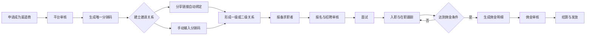

# 澜特分销逻辑说明

> 文档性质：产品逻辑梳理稿  
> 适用范围：广州澜特 Web 管理后台、Mob 小程序  
> 整理日期：2026-07-23  
> 当前状态：依据现有原型整理；标记为“待确认”的内容需在开发前完成产品决策。

## 1. 业务目标

澜特分销体系用于发展和管理渠道商，通过专属分销码建立最多二级的上下级关系。渠道商可以报备求职者并跟踪报名、面试、入职和在职结果；系统依据岗位佣金规则、渠道商独立配置及等级倍率计算佣金，最终进入审核和发放流程。

完整链路如下：



## 2. 参与角色

| 角色 | 主要权限 |
|---|---|
| 平台管理员 | 审核渠道商、管理分销关系、配置佣金规则、查看全部团队数据、审核和发放佣金 |
| 平台直营渠道商 | 无上级；可以报备求职者、发展一级、查看本人及团队数据 |
| 一级 | 由平台直营渠道商直接邀请；可以报备求职者，并继续发展二级 |
| 二级 | 由一级邀请；可以报备求职者，但不可继续发展下级 |
| 求职者 | 被渠道商报备或自行报名岗位，进入招聘审核及入职流程 |

### 2.1 层级口径

产品和研发统一采用“一级 / 二级”的表达：

- 平台直营渠道商：平台直接管理，无上级。
- 一级：由平台直营渠道商直接邀请。
- 二级：由一级继续邀请。
- 系统最多保留二级，二级不可发展新的渠道商。

后台和小程序页面统一使用“一级 / 二级”字段值，渠道商等级（A级 / B级 / C级）与分销层级分开维护。

## 3. 渠道商准入

### 3.1 申请入口

Mob 端支持以下入口：

1. 用户主动点击“申请成为渠道商”。
2. 用户通过渠道商分享的邀请链接进入申请页。
3. 用户已有分销码，在申请页手动填写上级分销码。

### 3.2 申请规则

- 上级分销码为选填项。
- 邀请链接进入时，系统自动带入上级分销码。
- 未填写上级分销码的申请人，审核通过后作为平台直营渠道商。
- 提交申请前，用户须同意渠道商相关协议。
- 申请状态建议包含：草稿、待审核、审核通过、审核驳回、已停用。
- 审核通过后，系统为渠道商生成全局唯一且不可重复的分销码。

### 3.3 渠道商基础资料

渠道商至少包含以下信息：

- 渠道商姓名或名称
- 手机号
- 唯一分销码
- 渠道商等级
- 上级渠道商
- 当前层级
- 状态
- 佣金倍率
- 结算周期
- 创建时间及审核信息

## 4. 分销关系建立

### 4.1 绑定方式

支持两种方式：

1. **分享邀请自动绑定**：用户从上级渠道商分享的链接进入，系统自动记录邀请人和分销码。
2. **手动分销码绑定**：用户输入上级分销码，系统校验后建立关系，适用于线下邀请。

### 4.2 绑定校验

系统绑定前应校验：

- 分销码是否存在、有效且对应活跃渠道商。
- 用户是否已经是渠道商。
- 用户是否已经绑定上级。
- 是否存在本人绑定本人。
- 是否形成循环关系。
- 绑定后是否超过二级分销限制。
- 上级渠道商是否具有继续发展下级的权限。

### 4.3 关系变更

建议规则：

- 渠道商关系一经审核生效，不允许用户自行修改。
- 确需更换上级时，由后台发起关系变更并记录变更原因、操作人和时间。
- 关系变更不追溯修改历史报备、历史佣金和已结算记录。
- 上级停用时，下级历史归属保留；能否重新挂接新上级属于待确认事项。

## 5. 求职者报备与归属

### 5.1 报备方式

渠道商在 Mob 端填写求职者资料并提交报备。报备时支持选择：

- **我的团队**：归属于当前渠道商本人。
- **二级团队**：选择具体下级成员，报备归属于被选择的下级，并同步汇总到上级团队数据。

系统设置中维护统一的“报备保护期”。在保护期内，同一求职者同一岗位未入职前只能存在一个有效渠道商报备；不同岗位可以归属不同渠道商。求职者从原岗位离职后，允许其他渠道商再次报备同一岗位，并建立新的报备关系。

### 5.2 报备后的招聘流程

报备成功后，求职者进入正常招聘链路：

> 已报备 → 已报名/待审核 → 待面试 → 面试通过 → 待入职 → 已入职 → 在职或离职

建议增加的异常状态：报备驳回、报名取消、面试未通过、放弃入职、入职撤销、重复报备、归属失效。

### 5.3 业绩统计口径

- 报备数：成功创建且未被判定为无效或重复的报备数量。
- 报名数：报备人成功报名至少一个岗位的数量。
- 面试数：已生成有效面试安排的数量。
- 入职数：入职审核通过并生成员工关系的数量。
- 在职资源数：当前处于在职状态且仍归属于渠道商的员工数量。
- 团队数据：本人数据加全部有效下级数据，不应重复累计同一求职者。

### 5.4 已确定的归属规则

1. 同一求职者在同一岗位未入职前，只允许一个渠道商有效报备；以首次有效报备为准。
2. 同一求职者可以被不同渠道商报备到不同岗位。
3. 求职者入职某岗位后，该岗位报名关系绑定对应渠道商；其他岗位仍可按各自报备关系处理。
4. 求职者从原岗位离职后，允许其他渠道商再次报备同一岗位。
5. 保护期由系统设置统一维护，支持后台选择具体天数或长期有效。

示例：张三可以由渠道商A报备普工、由渠道商B报备分拣工；张三未入职普工前，渠道商C不能再次报备普工。张三从普工离职后，渠道商C可以重新报备普工。张三入职分拣工后，该岗位关系绑定渠道商B。

## 6. 渠道商数据权限

渠道商可查看：

- 本人分销码及邀请链接
- 本人上下级关系
- 本人报备、报名、面试、入职和在职数据
- 下级成员及团队汇总数据
- 本人预计佣金、待结算佣金和已发放佣金
- 与本人报备求职者相关的必要招聘进度

渠道商不可查看：

- 平台完整分销规则和内部佣金成本
- 其他团队的渠道商及求职者数据
- 平台全部岗位推荐数据
- 求职者与招聘无关的敏感资料
- 后台审核意见、内部备注等平台管理信息

手机号、身份证等个人信息应按权限脱敏展示。

## 7. 佣金配置体系

### 7.1 岗位佣金规则

岗位是佣金规则的主要载体。新增或编辑岗位时可配置：

- 是否开启分销推广
- 佣金模式
- 达标条件
- 直接推荐奖励
- 间接推荐奖励
- 发放周期
- 适用渠道商等级倍率

关闭分销推广的岗位不产生渠道商佣金。

### 7.2 渠道商独立佣金配置

Web 端支持为指定渠道商设置独立佣金方案，用于特殊合作价格。包含：

- 佣金方式
- 阶梯条件
- 阶梯金额
- 计费单位
- 结算周期
- 渠道商倍率
- 启用状态

该配置应定位为“渠道商特殊覆盖规则”，不再重复维护岗位的通用佣金规则。

### 7.3 渠道商等级倍率

现有原型示例：

| 等级 | 基础倍率 | 默认结算周期 |
|---|---:|---|
| A级 | 1.5倍 | 按月 |
| B级 | 1.2倍 | 按月 |
| C级 | 1.0倍 | 一次性或按规则 |

新增等级支持维护等级名称、倍率、适用条件、状态和等级说明。

### 7.4 规则优先级

三类规则同时存在时，优先级固定为：

> **岗位规则 ＞ 渠道商独立规则 ＞ 渠道商等级默认规则**

执行规则：

1. 岗位配置了有效佣金规则时，只使用岗位规则。
2. 岗位没有有效规则时，读取该渠道商的独立规则。
3. 前两者都没有配置时，使用渠道商等级默认规则。
4. 三类规则不得无条件重复叠加；渠道商等级倍率只作用于最终选中的基础佣金规则。
5. 规则最终在入职审核时确定，不以报名时间的规则为准。

## 8. 佣金模式

### 8.1 在职天数阶梯

员工连续在职达到指定天数后触发佣金，例如：

- 满30天：200元
- 满60天：500元
- 满90天：1000元

现有原型采用累计制，即满90天同时触发30天、60天和90天档位。业务需确认是否保持累计制，或改为只发最高档/补差制。

### 8.2 满岗条件

可按以下指标判断是否达标：

- 在职天数
- 实际工时
- 出勤天数

达到指定指标后按一次性金额、元/天或元/小时计算。

### 8.3 固定金额

员工入职成功后触发一次性介绍费，不依赖后续在职时长。是否需要设置最低在职保护天数属于待确认事项。

### 8.4 直接与间接佣金

- 直接推荐人获得直接推荐奖励。
- 直接推荐人的上级可获得间接推荐奖励。
- 二级之外不再产生佣金。
- 间接奖励是否也乘以上级自身等级倍率，需要产品明确。

建议计算结构：

```text
直接佣金 = 当前有效基础佣金 × 直接推荐人等级倍率
间接佣金 = 当前有效间接奖励 × 上级渠道商等级倍率
```

## 9. 佣金生成与结算

### 9.1 入职审核时确定规则

岗位佣金修改后，历史已报名人员不按报名时规则计算，也不简单按结算时最新规则计算；以**入职审核通过时生效的规则**为准。入职审核通过时系统应锁定本次佣金规则快照：

- 岗位及项目
- 直接、间接渠道商
- 分销层级
- 入职审核时生效的佣金模式
- 阶梯条件和金额
- 入职审核时的渠道商等级及倍率
- 结算周期

入职审核通过后再修改岗位或渠道商规则，不影响本次入职佣金。同一求职者重复入职时，每次入职都重新按该次入职审核时的规则和条件独立计算。

### 9.2 佣金状态

建议佣金明细状态包括：

| 状态 | 说明 |
|---|---|
| 待达标 | 已建立归属，但尚未满足在职或满岗条件 |
| 待确认 | 已达到条件，等待系统或运营确认 |
| 待审核 | 已生成佣金单，等待后台审核 |
| 已驳回 | 数据异常或不符合结算要求 |
| 待发放 | 审核通过，等待付款 |
| 已发放 | 已完成佣金支付 |
| 已失效 | 离职、撤销入职、虚假报备等导致失效 |
| 已冲减 | 已计提或已结算后发生退款、追回或负向调整 |

### 9.3 异常与佣金处理

- 员工提前离职：检查是否已满足岗位满岗条件；已满足的佣金保留，未满足的佣金取消。
- 入职撤销：直接取消本次佣金。
- 虚假报备：直接取消本次佣金；如已发放，生成追回/冲减记录。
- 重复入职：每次入职视为独立业务，按本次入职审核时的条件重新计算，不与历史入职合并。
- 重复结算：系统以求职者、岗位、入职批次、档位和佣金类型生成唯一结算标识。
- 规则或考勤数据修正：保留原版本，生成新的调整记录及审核轨迹。

## 10. Web 与 Mob 功能分工

### 10.1 Web 管理后台

- 渠道商列表及新增渠道商
- 渠道商详情和上下级关系维护
- 查看个人及团队业绩
- 渠道商等级管理
- 岗位佣金规则配置
- 渠道商独立佣金配置
- 佣金明细、审核、结算和导出
- 渠道商启用、停用及异常处理

### 10.2 Mob 小程序

- 申请成为渠道商
- 通过邀请链接或分销码绑定上级
- 展示本人分销码并分享邀请
- 报备求职者
- 选择本人或下级团队归属
- 查看本人及团队招聘数据
- 查看本人佣金概览和发放记录
- 在“我的”中切换渠道商角色

Mob 端不应展示平台内部佣金规则和岗位推荐配置。

## 11. 当前原型存在的主要问题

1. 岗位配置中仍存在“公开给渠道商”的选项，与“不向渠道商展示分销规则”的要求冲突，需继续清理。
2. 分销规则页仍分别展示“在职天数”和“满岗条件”，但岗位端已要求合并为统一阶梯条件模式，需统一配置模型。
3. 团队业绩的去重及统计口径需要开发按“求职者 + 岗位 + 报备关系”实现。
4. 关系变更、渠道商停用及上下级解绑后的历史数据处理仍需定义。

## 12. 开发前必须确认的决策清单

- [x] 分销层级统一为一级 / 二级
- [x] 报备保护期由系统设置统一维护
- [x] 同岗位未入职前唯一报备、不同岗位可分别归属、离职后可重新报备同岗
- [x] 岗位规则 ＞ 渠道商独立规则 ＞ 渠道商等级默认规则
- [x] 佣金按入职审核时生效规则计算
- [x] 提前离职按满岗条件判断；入职撤销和虚假报备直接取消；重复入职按每次独立计算
- [ ] 阶梯佣金采用累计制、最高档制还是补差制
- [ ] 间接佣金及等级倍率的计算公式
- [ ] 固定金额佣金的最低在职条件
- [ ] 渠道关系是否允许变更及变更审批方式
- [ ] 渠道商停用后历史求职者和佣金如何处理
- [x] 佣金明细状态：待达标、待审核、已驳回、待发放、已发放、失效、已冲减
- [ ] 佣金审核、付款、失效和冲减的具体角色权限
- [ ] 渠道商可见的求职者资料范围和脱敏规则

---

## 变更记录

| 日期 | 版本 | 说明 |
|---|---|---|
| 2026-07-23 | V1.0 | 根据当前 Web/Mob 原型首次整理分销业务全链路、佣金体系及待确认规则 |
| 2026-07-23 | V1.1 | 更新规则优先级、一级/二级层级口径、岗位报备保护期、入职审核时佣金计算、异常佣金处理及佣金状态明细 |
